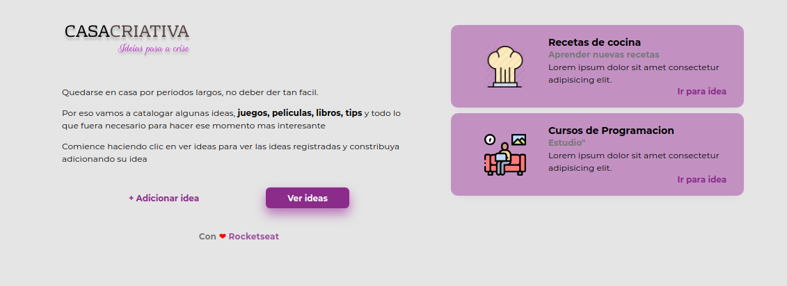

<p align="center">
  
</p>


# <p align="center">💻 Casa Creativa - WorkshopDev</p>

## Sobre
Es una site donde se pueden conpartir diversas ideas (diversión, entretenimiento, juegos, entre otros), que puedan ser realizadas durante la cuarentena implantada durante el COVID19.

## 🤔 Como ejecutar el proyecto? 

Estas instrucciones te permitirán obtener una copia del proyecto en funcionamiento en tu máquina local para propósitos de desarrollo y pruebas.

### Instalación y ejecución a través del terminal 🔧

Abra el terminal de su computadora y realice los siguientes pasos:


```bash
#Clone el repositorio
git clone https://github.com/maferlape/CasaCreativa-WS

# Entre en el directorio
cd ws

# Baje las dependencias
npm i

# Inicie el servidor de desenvolvimiento
npm run dev
```

### Después del paso anterior, abra su navegador y acesse `http://localhost:3000/`


## Tecnologías Utilizadas 🛠️

* [JavaScript](https://www.javascript.com/)
* [HTML](https://www.w3schools.com/html/)
* [CSS](https://www.w3.org/Style/CSS/Overview.en.html)
* [Node.js](https://nodejs.org/en/)
* [Express](https://expressjs.com/)
* [SQLite3](https://www.sqlite.org/index.html)
* [Nunjucks](https://mozilla.github.io/nunjucks/)

## 📄 Licencia 

Este proyecto está bajo la Licencia MIT- mira el archivo [LICENSE](LICENSE.md) para detalles

## 🎁Gracias 

* **Rocketseat** - *Plataforma de educación en tecnología* - [Rocketseat](https://github.com/rocketseat)

* **Mayk Brito** - *Diseñador de la interfaz y Profesor guía* - [maykbrito](https://github.com/maykbrito)

---
⌨️ con ❤️ por [Maria Lares](www.linkedin.com/in/maria-lares) 😊
